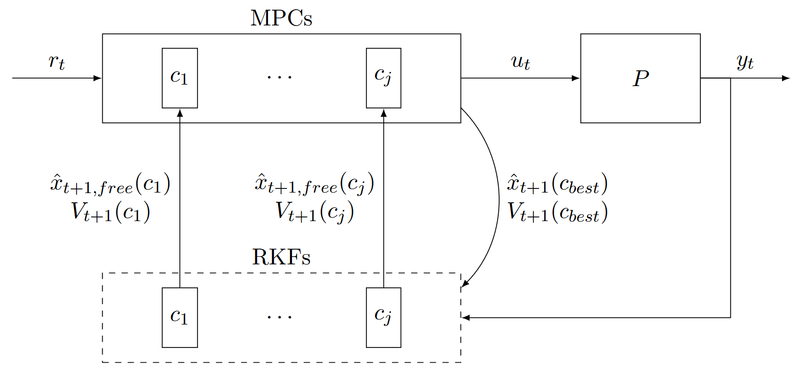
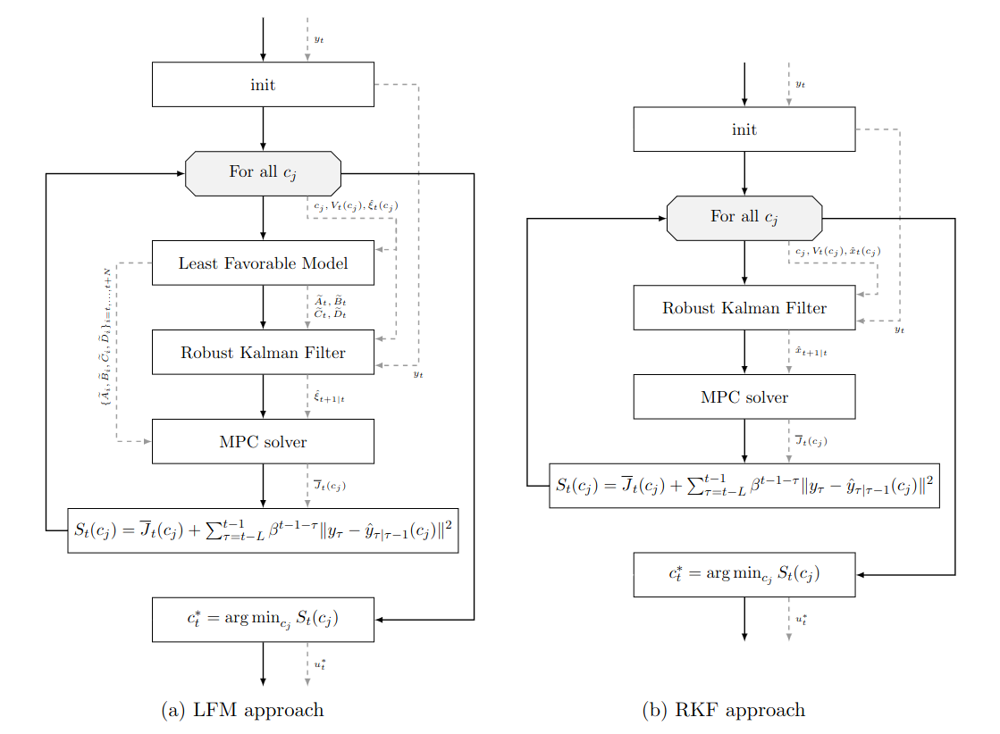
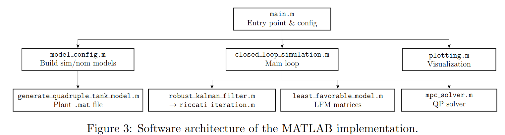

# Robust Data Driven Model Predictive Control

> **Course:** Learning Dynamical Systems – Constrol System Engineering  
> **University:** University of Padua  
> **Academic Year:** 2025/2026  
> **Authors:** Lorenzo Favaron, Luca Galeazzo, Lorenzo Trubian  

## Abstract and Objectives
Associated to a Robust Kalman FIlter with a relative entropy tolerance applied to each time increment, there is a Least-Favorable Model. This project has two main goals: 

- include this LFM as nominal model in a linear MPC;
- add the selection of the optimal relative entropy tolerance to the optimization procedure.

The analysis compared different strategies in the usage of the available information.

## Theoretical Background

**Key Equations:**  State-space representation of a system

$$x(k+1) = A x(k) + Bv(k)+ K u(k) $$ $$ y(k) = C x(k) + Dv(k)$$

Idea to implement

$$\min_{c, u, \hat{y}, \hat{x}} \sum_{t=-L}^{0} \beta^t\| y_t - \hat{y}_{t|t-1}(c) \|^2 + J(x(k), \mathbf{u}_k, k) $$

QP problem solving the MPC

$$J(x(k), \mathbf{u}_k, k) = \sum_{i=0}^{N-1} \left[ \|x(k+i)\|^2_{C^\top Q C} + \|u(k+i)\|^2_R\right] + \|x(k+N)\|^2_{C^\top P_f C}$$

**Assumptions:** Linear system with Gaussian Noise.

**References:** B. Levy and R. Nikoukhah, "Robust state-space filtering under incremental
    model perturbations subject to a relative entropy tolerance," *IEEE Trans.
    Autom. Control*, vol. 58, pp. 682–695, Mar. 2013

## Methodology & Implementation
A more detailed description of the whole project is in the [project overview](./docs/project_overview.pdf)
### Closed-loop block scheme

### Algorithm Description 

### Software Architecture 

### Tools & Dependencies
- **Language:** MATLAB R2025b
- **Libraries:** Control Systems Toolbox, Optimization Toolbox, OSQP (optional)

Execute the [install_osqp.m](./src/install_osqp.m) script 
or set `install_osqp_library = true;` in [main.m](./src/main.m)
to install the OSQP solver, which is faster than the default MATLAB one `quadprog` due to the MPC implemented in sparse formulation.

## License
This project is submitted for academic purposes only.
